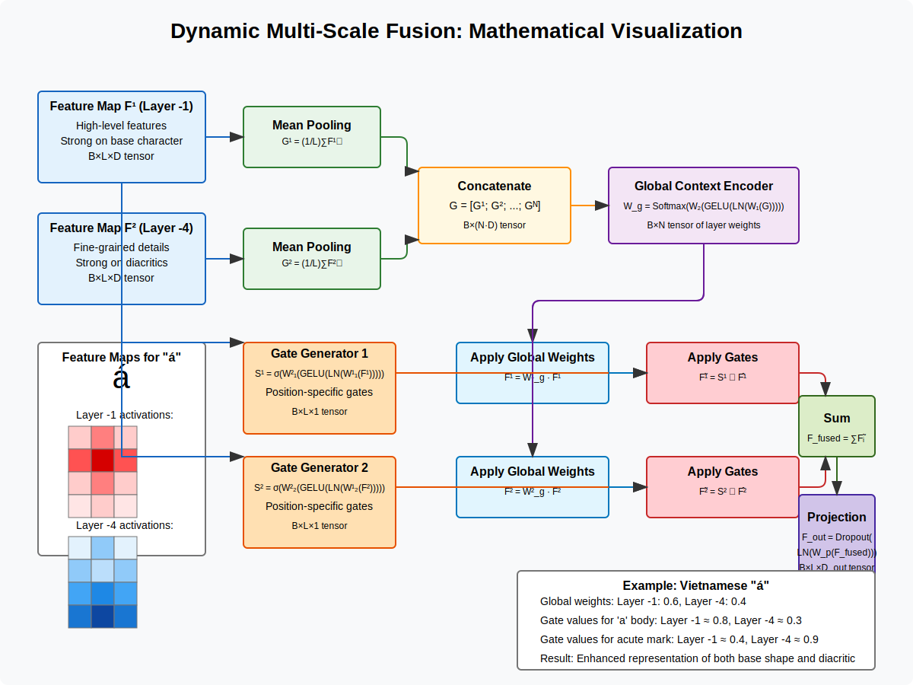

# Dynamic Multi-Scale Fusion

## Mathematical Formulation

The Dynamic Multi-Scale Fusion module adaptively combines features from different encoder layers based on content and spatial position. Let's formalize this process:

### Input
- Feature maps from $N$ encoder layers: $\{F^1, F^2, ..., F^N\}$
- Each feature map $F^i \in \mathbb{R}^{B \times L \times D}$, where:
  - $B$ is the batch size
  - $L$ is the sequence length
  - $D$ is the feature dimension

### 1. Global Context Encoder

**Purpose**: Generate global importance weights for each encoder layer based on content.

**Input Transformation**:
For each feature map $F^i$, compute a global representation via mean pooling:
$$G^i = \frac{1}{L} \sum_{j=1}^{L} F^i_j \in \mathbb{R}^{B \times D}$$

Concatenate the global features:
$$G = [G^1; G^2; ...; G^N] \in \mathbb{R}^{B \times (N \cdot D)}$$

**Global Weight Computation**:
$$W_g = \text{Softmax}(W_2(\text{GELU}(\text{LN}(W_1(G)))))$$

Where:
- $W_1 \in \mathbb{R}^{(N \cdot D) \times 512}$ and $W_2 \in \mathbb{R}^{512 \times N}$ are learnable parameters
- $\text{LN}$ is LayerNorm
- $W_g \in \mathbb{R}^{B \times N}$ represents global importance weights

### 2. Gate Generation (Position-Specific Weighting)

**Purpose**: Generate position-specific weights for fine-grained control.

For each layer $i$, apply a gate generator to obtain position-specific gates:
$$S^i = \sigma(W_{g2}^i(\text{GELU}(\text{LN}(W_{g1}^i(F^i)))))$$

Where:
- $W_{g1}^i \in \mathbb{R}^{D \times (D/2)}$ and $W_{g2}^i \in \mathbb{R}^{(D/2) \times 1}$ are learnable parameters
- $\sigma$ is sigmoid activation
- $S^i \in \mathbb{R}^{B \times L \times 1}$ represents position-specific gates for layer $i$

### 3. Feature Fusion

**Combined Weighting**:
First, apply global weights to each position in each layer:
$$\hat{F}^i = W_g^i \cdot F^i$$

Then, apply position-specific gates:
$$\tilde{F}^i = S^i \odot \hat{F}^i$$

Where $\odot$ denotes element-wise multiplication with broadcasting.

**Final Fusion**:
$$F_{fused} = \sum_{i=1}^{N} \tilde{F}^i$$

**Projection to Output Dimension**:
$$F_{out} = \text{Dropout}(\text{LN}(W_p(F_{fused})))$$

Where $W_p \in \mathbb{R}^{D \times D_{out}}$ is a learnable projection matrix.

## Visual Representation



## Example: Vietnamese Character "á"

Let's walk through a concrete example of how the Dynamic Multi-Scale Fusion processes the Vietnamese character "á".

### Input Features

Assume we have features from two encoder layers:
- $F^1$: From the last layer (layer -1), capturing high-level semantic information
- $F^2$: From an earlier layer (layer -4), capturing more fine-grained details

For the character "á":
- $F^1$ might have strong activations for the overall "a" shape
- $F^2$ might have stronger activations for the acute accent mark

### Global Context Analysis

1. The global context encoder pools features across all positions and analyzes them
2. For "á", it might determine:
   - Layer -1 has a weight of 0.6 (60%) for the base character shape
   - Layer -4 has a weight of 0.4 (40%) for the detailed accent mark

### Position-Specific Gating

The gate generators produce position-specific weights:
1. For positions around the main body of "a":
   - Higher gate values (e.g., 0.8) for layer -1 features
   - Lower gate values (e.g., 0.3) for layer -4 features
   
2. For positions around the acute accent mark:
   - Lower gate values (e.g., 0.4) for layer -1 features
   - Higher gate values (e.g., 0.9) for layer -4 features

### Adaptive Fusion Result

The resulting fused features will have:
- Strong representation of the base "a" shape from layer -1
- Enhanced representation of the acute accent from layer -4
- Position-aware feature distribution that adapts to different parts of the character

This adaptive fusion is crucial for Vietnamese characters because:
1. The base shape and diacritical marks have different scales and require features from different layers
2. The fusion weights adapt based on each character's content (different characters may need different fusion strategies)
3. Different positions within the same character (base vs. diacritic) need different feature representations

## Visualizing Fusion Weights

For the character "á", the fusion mechanism might produce weights that look like:

Global weights:
```
Layer -1 (high-level): 0.60
Layer -4 (detailed):   0.40
```

Position-specific gates (visualized as a heatmap over the character):

```
Layer -1 gates:
[0.8, 0.8, 0.8]  <- Main body of 'a'
[0.7, 0.8, 0.7]
[0.6, 0.7, 0.6]
[0.4, 0.5, 0.4]  <- Area of acute accent
```

```
Layer -4 gates:
[0.3, 0.3, 0.3]  <- Main body of 'a'
[0.4, 0.3, 0.4]
[0.6, 0.5, 0.6]
[0.9, 0.8, 0.9]  <- Area of acute accent
```

The final contribution of each layer at each position is the product of the global weight and position-specific gate, resulting in carefully balanced feature fusion that adapts to the character's structure.

## Comparison with Other Fusion Methods

| Method | Description | Limitation for Vietnamese OCR |
|--------|-------------|------------------------------|
| **Simple Concatenation** | Direct concatenation of features from different layers | No adaptive weighting; treats all layers equally |
| **Fixed Weighted Sum** | Sum of features with fixed weights | Cannot adapt weights based on content |
| **Attention-based Fusion** | Uses attention to combine features | Often doesn't consider multi-scale nature explicitly |
| **Dynamic Multi-Scale Fusion** | Content and position-adaptive weighting | More complex, but handles Vietnamese characters better |

## Implementation Details

The core implementation in PyTorch:

```python
class DynamicMultiScaleFusion(nn.Module):
    def __init__(self, encoder_output_size, num_layers=2, fusion_dim=None, use_gate=True):
        super().__init__()
        self.encoder_output_size = encoder_output_size
        self.num_layers = num_layers
        self.fusion_dim = fusion_dim if fusion_dim is not None else encoder_output_size
        self.use_gate = use_gate
        
        # Global context encoder for content-based weighting
        self.context_encoder = nn.Sequential(
            nn.Linear(encoder_output_size * num_layers, 512),
            nn.LayerNorm(512),
            nn.GELU(),
            nn.Dropout(0.1),
            nn.Linear(512, num_layers),
        )
        
        # Position-specific gate generators
        if self.use_gate:
            self.gate_generators = nn.ModuleList([
                nn.Sequential(
                    nn.Linear(encoder_output_size, encoder_output_size // 2),
                    nn.LayerNorm(encoder_output_size // 2),
                    nn.GELU(),
                    nn.Dropout(0.1),
                    nn.Linear(encoder_output_size // 2, 1),
                )
                for _ in range(num_layers)
            ])
        
        # Projection to output dimension
        self.fusion_projection = nn.Sequential(
            nn.Linear(encoder_output_size, self.fusion_dim),
            nn.LayerNorm(self.fusion_dim),
            nn.Dropout(0.1)
        )
```

The forward pass implementation shows how the features are processed:

```python
def forward(self, features_list):
    batch_size, seq_length, _ = features_list[0].shape
    
    # 1. Global layer importance using sequence mean features
    global_features = []
    for features in features_list:
        mean_features = torch.mean(features, dim=1)
        global_features.append(mean_features)
    
    concatenated_global = torch.cat(global_features, dim=-1)
    global_weights = self.context_encoder(concatenated_global)
    global_weights = F.softmax(global_weights, dim=-1)
    
    # 2. Apply global weights to each layer
    globally_weighted = []
    for i, features in enumerate(features_list):
        layer_weight = global_weights[:, i:i+1, None]
        weighted_features = features * layer_weight.expand_as(features)
        globally_weighted.append(weighted_features)
    
    # 3. Position-specific gating (if enabled)
    if self.use_gate:
        gated_features = []
        for i, features in enumerate(features_list):
            gates = torch.sigmoid(self.gate_generators[i](features))
            gated = features * gates
            gated_features.append(gated)
        
        # Combine global weights and gates
        fused_features = sum(gated_features)
    else:
        # Use only globally weighted features
        fused_features = sum(globally_weighted)
    
    # 4. Apply final projection
    fused_features = self.fusion_projection(fused_features)
    
    return fused_features
```