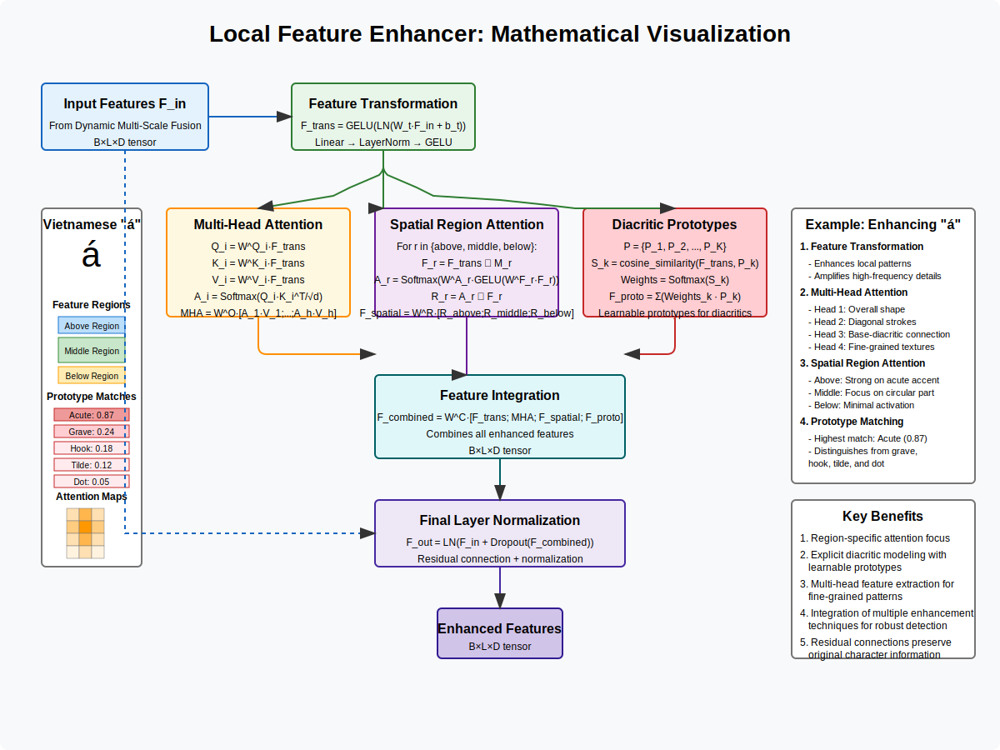

# Local Feature Enhancer for Diacritical Marks

## Mathematical Formulation

The Local Feature Enhancer is specifically designed to highlight subtle visual features critical for diacritical mark recognition in Vietnamese text. Let's formalize each component of this mechanism:

### Input
- Feature representations after fusion: $F_{in} \in \mathbb{R}^{B \times L \times D}$, where:
  - $B$ is the batch size
  - $L$ is the sequence length
  - $D$ is the feature dimension

### 1. Feature Transformation

**Purpose**: Transform input features to enhance local patterns relevant to diacritical marks.

**Transformation Process**:
$$F_{trans} = \text{GELU}(\text{LN}(W_{t}F_{in} + b_{t}))$$

Where:
- $W_{t} \in \mathbb{R}^{D \times D_{mid}}$ is a learnable weight matrix
- $b_{t} \in \mathbb{R}^{D_{mid}}$ is a bias vector
- $\text{LN}$ is Layer Normalization
- $\text{GELU}$ is Gaussian Error Linear Unit activation
- $F_{trans} \in \mathbb{R}^{B \times L \times D_{mid}}$ represents transformed features

### 2. Multi-Head Self-Attention

**Purpose**: Capture fine-grained patterns and relationships at the character level.

**Multi-Head Attention Computation**:

First, project features to queries, keys, and values for each attention head:
$$Q_i = W^Q_i F_{trans}, K_i = W^K_i F_{trans}, V_i = W^V_i F_{trans}$$

Where:
- $W^Q_i, W^K_i, W^V_i \in \mathbb{R}^{D_{mid} \times (D_{mid}/h)}$ are learnable parameters for head $i$
- $h$ is the number of attention heads (typically 4)
- $Q_i, K_i, V_i \in \mathbb{R}^{B \times L \times (D_{mid}/h)}$

Compute attention scores and weighted values for each head:
$$A_i = \text{Softmax}\left(\frac{Q_i K_i^T}{\sqrt{D_{mid}/h}}\right)$$
$$H_i = A_i V_i$$

Where:
- $A_i \in \mathbb{R}^{B \times L \times L}$ is the attention matrix for head $i$
- $H_i \in \mathbb{R}^{B \times L \times (D_{mid}/h)}$ is the output of head $i$

Concatenate and project the outputs from all heads:
$$\text{MHA}(F_{trans}) = W^O [H_1; H_2; \ldots; H_h]$$

Where:
- $W^O \in \mathbb{R}^{D_{mid} \times D_{mid}}$ is a learnable projection matrix
- $\text{MHA}(F_{trans}) \in \mathbb{R}^{B \times L \times D_{mid}}$ is the multi-head attention output

### 3. Spatial Region Attention

**Purpose**: Focus on specific regions where diacritics typically appear (above, middle, below character).

**Region Definition**:
Define three region masks $M_{above}, M_{middle}, M_{below} \in \mathbb{R}^{H \times W}$ where:
- $H$ and $W$ are the height and width of the feature map
- Each mask emphasizes different vertical regions of the character

**Region-Specific Attention**:
For each region $r \in \{above, middle, below\}$:

1. Apply region mask to features:
$$F_r = F_{trans} \odot M_r$$

2. Compute region-specific attention:
$$A_r = \text{Softmax}(W^A_r \cdot \text{GELU}(W^F_r F_r))$$

3. Apply attention to extract region features:
$$R_r = A_r \odot F_r$$

Where:
- $W^F_r \in \mathbb{R}^{D_{mid} \times D_{mid}}$ and $W^A_r \in \mathbb{R}^{D_{mid} \times 1}$ are learnable parameters
- $A_r \in \mathbb{R}^{B \times L \times 1}$ is the attention map for region $r$
- $R_r \in \mathbb{R}^{B \times L \times D_{mid}}$ are the region-specific features

**Region Feature Integration**:
$$F_{spatial} = W^R [R_{above}; R_{middle}; R_{below}]$$

Where:
- $W^R \in \mathbb{R}^{(3 \cdot D_{mid}) \times D_{mid}}$ is a learnable projection matrix
- $F_{spatial} \in \mathbb{R}^{B \times L \times D_{mid}}$ represents the spatially-enhanced features

### 4. Diacritic Prototype Learning

**Purpose**: Learn and leverage prototypical patterns for different diacritic types.

**Prototype Definition**:
Define learnable prototypes for each diacritic type:
$$P = \{P_1, P_2, \ldots, P_K\}$$

Where:
- $K$ is the number of diacritic types in Vietnamese (typically 5 main types)
- Each $P_k \in \mathbb{R}^{D_{mid}}$ is a learnable prototype vector

**Prototype Matching**:
1. Compute similarity between features and each prototype:
$$S_{k} = \text{cosine\_similarity}(F_{trans}, P_k)$$

2. Generate prototype-weighted features:
$$F_{proto} = \sum_{k=1}^{K} \text{Softmax}(S_k) \cdot P_k$$

Where:
- $S_k \in \mathbb{R}^{B \times L \times 1}$ is the similarity score with prototype $k$
- $F_{proto} \in \mathbb{R}^{B \times L \times D_{mid}}$ represents prototype-enhanced features

### 5. Feature Integration and Normalization

**Feature Integration**:
Combine multi-head attention, spatial attention, and prototype features:
$$F_{combined} = W^C [F_{trans}; \text{MHA}(F_{trans}); F_{spatial}; F_{proto}]$$

Where:
- $W^C \in \mathbb{R}^{(4 \cdot D_{mid}) \times D}$ is a learnable projection matrix
- $F_{combined} \in \mathbb{R}^{B \times L \times D}$ represents the combined features

**Final Normalization**:
$$F_{out} = \text{LN}(F_{in} + \text{Dropout}(F_{combined}))$$

Where:
- $F_{out} \in \mathbb{R}^{B \times L \times D}$ is the output of the Local Feature Enhancer
- The residual connection ($F_{in} + ...$) allows the original information to flow through

## Visual Representation



## Example: Enhancing the Acute Accent in "á"

Let's walk through a concrete example of how the Local Feature Enhancer processes the Vietnamese character "á" with an acute accent.

### Input Features

After the Dynamic Multi-Scale Fusion, the features $F_{in}$ contain information about both the base character "a" and its acute accent, but the diacritical information might not be sufficiently prominent.

### Feature Transformation

The transformation step enhances local patterns:
- For areas corresponding to the acute accent, the transformation amplifies high-frequency details
- For the base character, it preserves the overall shape information

### Multi-Head Attention

The 4 attention heads analyze different aspects of the character:
- **Head 1**: Focuses on overall character shape
- **Head 2**: Specializes in diagonal strokes (relevant for the acute accent)
- **Head 3**: Attends to connections between the base and diacritics
- **Head 4**: Captures fine-grained texture information

For "á", attention heads 2 and 3 will show strong activations for the acute accent, reinforcing this critical feature.

### Spatial Region Attention

The three region-specific attention mechanisms focus on different vertical sections:
- **Above Region**: Shows strongest activation for the acute accent
- **Middle Region**: Focuses on the circular part of "a"
- **Below Region**: Shows minimal activation for "á" (would be stronger for characters with below diacritics like "ạ")

The above-region attention specifically enhances the acute accent, making it more distinctive.

### Diacritic Prototype Matching

The model compares features with learned prototypes for Vietnamese diacritics:
- **Acute Prototype**: Shows high similarity score for the diagonal mark in "á"
- **Grave Prototype**: Shows low similarity (the acute is upward, grave is downward)
- **Hook Prototype**: Shows low similarity
- **Tilde Prototype**: Shows low similarity
- **Dot Prototype**: Shows low similarity

The prototype matching provides additional guidance to distinguish between similar diacritics (e.g., acute vs. grave).

### Integration and Output

The combined features integrate all these specialized enhancements, resulting in:
- Strong representation of the acute accent
- Clear differentiation from other diacritics
- Maintained information about the base character

The final output $F_{out}$ preserves the overall character information while significantly enhancing the diacritical mark features, making subsequent classification more accurate.

## Visualizing Feature Enhancement

For the character "á", the feature enhancement process might produce attention patterns that look like:

Multi-Head Attention (Head 2, specialized for diagonal strokes):
```
[0.1, 0.2, 0.1]  <- Low attention areas
[0.2, 0.3, 0.2]
[0.3, 0.4, 0.3]
[0.7, 0.9, 0.7]  <- High attention on acute accent
```

Spatial Above-Region Attention:
```
[0.8, 0.9, 0.8]  <- High attention on acute accent region
[0.5, 0.6, 0.5]
[0.2, 0.3, 0.2]
[0.1, 0.1, 0.1]  <- Low attention on base character
```

Prototype Matching (similarity scores):
```
Acute: 0.87      <- Highest match
Grave: 0.24
Hook:  0.18
Tilde: 0.12
Dot:   0.05
```

## Comparison with Basic Feature Processing

| Approach | Description | Limitation for Vietnamese OCR |
|----------|-------------|------------------------------|
| **Standard Convolution** | Applies same filters across entire image | Cannot adapt to different character regions |
| **Basic Self-Attention** | Attends to all positions equally | Lacks specialized focus on diacritic regions |
| **Local Feature Enhancer** | Region-specific attention with diacritic prototypes | More complex, but handles Vietnamese diacritics much better |

## Implementation Details

Core implementation in PyTorch:

```python
class LocalFeatureEnhancer(nn.Module):
    def __init__(self, input_dim, hidden_dim=None, num_heads=4, dropout=0.1):
        super().__init__()
        self.input_dim = input_dim
        self.hidden_dim = hidden_dim if hidden_dim is not None else input_dim
        
        # 1. Feature transformation
        self.feature_transform = nn.Sequential(
            nn.Linear(input_dim, self.hidden_dim),
            nn.LayerNorm(self.hidden_dim),
            nn.GELU(),
            nn.Dropout(dropout)
        )
        
        # 2. Multi-head attention
        self.self_attention = nn.MultiheadAttention(
            embed_dim=self.hidden_dim,
            num_heads=num_heads,
            dropout=dropout,
            batch_first=True
        )
        
        # 3. Spatial region attention
        self.region_attentions = nn.ModuleDict({
            'above': self._make_region_attention(),
            'middle': self._make_region_attention(),
            'below': self._make_region_attention()
        })
        
        # Projections for region features
        self.region_projection = nn.Linear(3 * self.hidden_dim, self.hidden_dim)
        
        # 4. Diacritic prototypes
        num_prototypes = 5  # 5 main diacritic types in Vietnamese
        self.diacritic_prototypes = nn.Parameter(
            torch.randn(num_prototypes, self.hidden_dim)
        )
        self.prototype_projection = nn.Linear(self.hidden_dim, self.hidden_dim)
        
        # 5. Final integration
        self.output_projection = nn.Linear(4 * self.hidden_dim, input_dim)
        self.layer_norm = nn.LayerNorm(input_dim)
        self.dropout = nn.Dropout(dropout)
        
    def _make_region_attention(self):
        return nn.Sequential(
            nn.Linear(self.hidden_dim, self.hidden_dim),
            nn.GELU(),
            nn.Linear(self.hidden_dim, 1)
        )
        
    def forward(self, x):
        # Original input for residual connection
        residual = x
        
        # 1. Feature transformation
        transformed = self.feature_transform(x)
        
        # 2. Multi-head self-attention
        attn_output, _ = self.self_attention(
            transformed, transformed, transformed
        )
        
        # 3. Spatial region attention
        region_features = []
        for region_name, region_attn in self.region_attentions.items():
            # In practice, we would apply region masks differently
            # Here simplified for clarity
            attention_scores = torch.sigmoid(region_attn(transformed))
            region_feat = attention_scores * transformed
            region_features.append(region_feat)
            
        # Combine region features
        combined_regions = torch.cat(region_features, dim=-1)
        spatial_features = self.region_projection(combined_regions)
        
        # 4. Diacritic prototype matching
        # Normalize prototypes and features for cosine similarity
        norm_prototypes = F.normalize(self.diacritic_prototypes, p=2, dim=-1)
        norm_features = F.normalize(transformed, p=2, dim=-1)
        
        # Compute similarity with each prototype
        similarity = torch.einsum('bld,pd->blp', norm_features, norm_prototypes)
        attention_weights = F.softmax(similarity, dim=-1)
        
        # Weight features by prototype similarity
        proto_features = torch.einsum('blp,pd->bld', attention_weights, self.diacritic_prototypes)
        proto_features = self.prototype_projection(proto_features)
        
        # 5. Integrate all features
        combined = torch.cat([
            transformed,
            attn_output,
            spatial_features,
            proto_features
        ], dim=-1)
        
        enhanced = self.output_projection(combined)
        
        # Apply residual connection and normalization
        output = self.layer_norm(residual + self.dropout(enhanced))
        
        return output
```

The forward pass demonstrates how the different enhancer components integrate to create diacritic-aware feature representations.