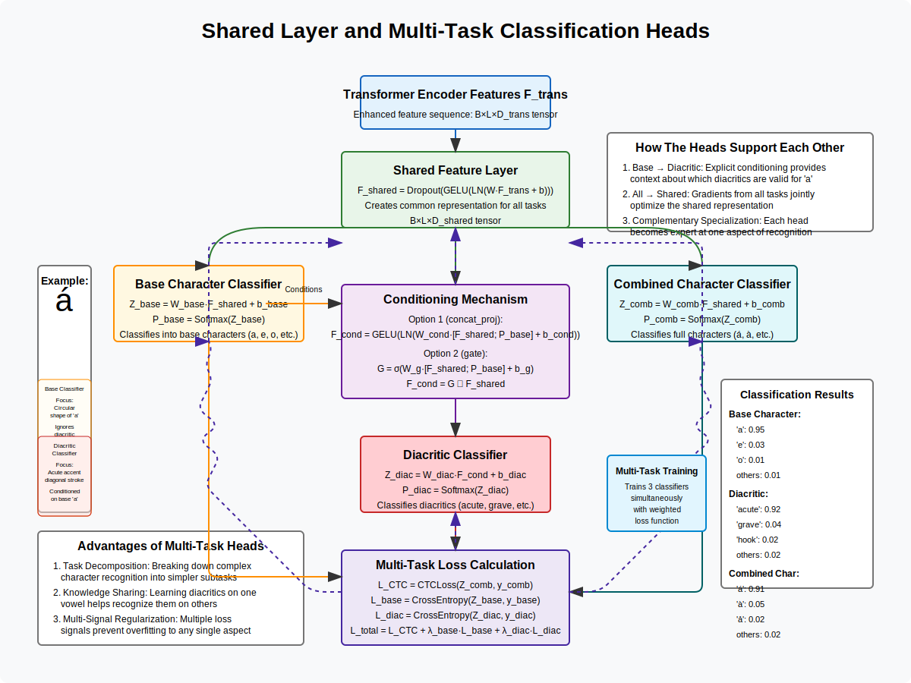

# Shared Layer and Multi-Task Classification Heads

## Mathematical Formulation

The Shared Layer and Multi-Task Classification Heads form the final stages of the hierarchical OCR architecture, efficiently decomposing the complex Vietnamese character recognition task into simpler sub-tasks. Let's formalize each component:

### Input
- Enhanced feature representations from the transformer encoder: $F_{trans} \in \mathbb{R}^{B \times L \times D_{trans}}$, where:
  - $B$ is the batch size
  - $L$ is the sequence length
  - $D_{trans}$ is the transformer output dimension

### 1. Shared Feature Layer

**Purpose**: Create a common representation that captures information relevant to all classification tasks.

**Transformation Process**:
$$F_{shared} = \text{Shared}(F_{trans})$$

Where Shared() consists of one or more layers with the following structure:
$$\text{Shared}_i(F) = \text{Dropout}(\text{GELU}(\text{LN}(W_i F + b_i)))$$

For multiple shared layers:
$$F_{shared} = \text{Shared}_n(\text{Shared}_{n-1}(...\text{Shared}_1(F_{trans})))$$

Where:
- $W_i \in \mathbb{R}^{D_i \times D_{i+1}}$ are learnable weight matrices
- $b_i \in \mathbb{R}^{D_{i+1}}$ are bias vectors
- $\text{LN}$ is Layer Normalization
- $\text{GELU}$ is Gaussian Error Linear Unit activation
- $\text{Dropout}$ applies regularization
- $F_{shared} \in \mathbb{R}^{B \times L \times D_{shared}}$ is the final shared representation

### 2. Base Character Classification Head

**Purpose**: Recognize the base character independent of diacritical marks (e.g., 'a', 'e', 'o').

**Classification Process**:
$$Z_{base} = W_{base}F_{shared} + b_{base}$$
$$P_{base} = \text{Softmax}(Z_{base})$$

Where:
- $W_{base} \in \mathbb{R}^{D_{shared} \times C_{base}}$ is a learnable weight matrix
- $b_{base} \in \mathbb{R}^{C_{base}}$ is a bias vector
- $C_{base}$ is the number of base character classes
- $Z_{base} \in \mathbb{R}^{B \times L \times C_{base}}$ are the logits
- $P_{base} \in \mathbb{R}^{B \times L \times C_{base}}$ are probabilities over base characters

### 3. Conditioning Mechanism

**Purpose**: Provide base character information to guide diacritic prediction.

Three conditioning methods are implemented:

#### A. Concatenation with Projection ("concat_proj")
$$F_{cond} = \text{GELU}(\text{LN}(W_{cond}[F_{shared}; P_{base}] + b_{cond}))$$

Where:
- $W_{cond} \in \mathbb{R}^{(D_{shared} + C_{base}) \times D_{shared}}$ is a learnable weight matrix
- $b_{cond} \in \mathbb{R}^{D_{shared}}$ is a bias vector
- $[F_{shared}; P_{base}]$ denotes concatenation along the feature dimension
- $F_{cond} \in \mathbb{R}^{B \times L \times D_{shared}}$ is the conditioned representation

#### B. Gating Mechanism ("gate")
$$G = \sigma(W_g[F_{shared}; P_{base}] + b_g)$$
$$F_{cond} = G \odot F_{shared}$$

Where:
- $W_g \in \mathbb{R}^{(D_{shared} + C_{base}) \times D_{shared}}$ is a learnable weight matrix
- $b_g \in \mathbb{R}^{D_{shared}}$ is a bias vector
- $\sigma$ is the sigmoid activation function
- $G \in \mathbb{R}^{B \times L \times D_{shared}}$ is the gate vector (values between 0 and 1)
- $\odot$ denotes element-wise multiplication
- $F_{cond} \in \mathbb{R}^{B \times L \times D_{shared}}$ is the gated representation

#### C. No Conditioning ("none")
$$F_{cond} = F_{shared}$$

### 4. Diacritic Classification Head

**Purpose**: Recognize the diacritical mark independent of the base character (e.g., 'acute', 'grave', 'hook').

**Classification Process**:
$$Z_{diac} = W_{diac}F_{cond} + b_{diac}$$
$$P_{diac} = \text{Softmax}(Z_{diac})$$

Where:
- $W_{diac} \in \mathbb{R}^{D_{shared} \times C_{diac}}$ is a learnable weight matrix
- $b_{diac} \in \mathbb{R}^{C_{diac}}$ is a bias vector
- $C_{diac}$ is the number of diacritic classes
- $Z_{diac} \in \mathbb{R}^{B \times L \times C_{diac}}$ are the logits
- $P_{diac} \in \mathbb{R}^{B \times L \times C_{diac}}$ are probabilities over diacritical marks

### 5. Combined Character Classification Head

**Purpose**: Recognize the full character with its diacritical mark directly (e.g., 'á', 'à', 'ả').

**Classification Process**:
$$Z_{comb} = W_{comb}F_{shared} + b_{comb}$$
$$P_{comb} = \text{Softmax}(Z_{comb})$$

Where:
- $W_{comb} \in \mathbb{R}^{D_{shared} \times C_{comb}}$ is a learnable weight matrix
- $b_{comb} \in \mathbb{R}^{C_{comb}}$ is a bias vector
- $C_{comb}$ is the number of combined character classes
- $Z_{comb} \in \mathbb{R}^{B \times L \times C_{comb}}$ are the logits
- $P_{comb} \in \mathbb{R}^{B \times L \times C_{comb}}$ are probabilities over combined characters

### 6. Multi-Task Loss Calculation

**Purpose**: Provide supervision signals for all three classification tasks.

**Loss Components**:

#### A. CTC Loss for Combined Characters
$$\mathcal{L}_{CTC} = \text{CTCLoss}(Z_{comb}, y_{comb})$$

Where:
- $\text{CTCLoss}$ is the Connectionist Temporal Classification loss function
- $Z_{comb}$ are the logits from the combined character classifier
- $y_{comb}$ are the ground truth combined character sequences

#### B. Optional Auxiliary Losses
$$\mathcal{L}_{base} = \text{CrossEntropy}(Z_{base}, y_{base})$$
$$\mathcal{L}_{diac} = \text{CrossEntropy}(Z_{diac}, y_{diac})$$

Where:
- $\text{CrossEntropy}$ is the cross-entropy loss function
- $Z_{base}$ and $Z_{diac}$ are the logits from respective classifiers
- $y_{base}$ and $y_{diac}$ are the ground truth labels

**Total Loss**:
$$\mathcal{L}_{total} = \mathcal{L}_{CTC} + \lambda_{base}\mathcal{L}_{base} + \lambda_{diac}\mathcal{L}_{diac}$$

Where:
- $\lambda_{base}$ and $\lambda_{diac}$ are weighting hyperparameters for the auxiliary losses

## Visual Representation



## Example: Processing the Vietnamese Character "á"

Let's walk through a concrete example of how the shared layer and multi-task heads process the Vietnamese character "á".

### Shared Layer Processing

The shared layer receives enhanced features from previous layers that already highlight both the base character and its diacritical mark. It creates a common representation that preserves information needed for all three classification tasks.

For "á", the shared representation would capture:
- The circular shape of the base character "a"
- The diagonal stroke of the acute accent
- Their spatial relationship

### Base Character Classification

The base character classifier focuses only on identifying the underlying letter, ignoring the diacritical mark:

Input: Enhanced features of "á"
Output probabilities:
```
'a': 0.95
'e': 0.03
'o': 0.01
...
```

The classifier correctly identifies the base character as 'a' with high confidence.

### Conditioning Mechanism

Using the "concat_proj" conditioning method, the base character probabilities are concatenated with the shared features and projected to create a conditioned representation. This gives the diacritic classifier valuable context about which base character it's dealing with.

For "á", knowing that the base character is 'a' helps the model focus on which diacritics are commonly used with 'a'.

### Diacritic Classification

The diacritic classifier, now armed with information about the base character, focuses on identifying the diacritical mark:

Input: Conditioned representation of "á"
Output probabilities:
```
'acute': 0.92
'grave': 0.04
'hook': 0.02
'tilde': 0.01
'dot': 0.01
...
```

The classifier correctly identifies the diacritical mark as 'acute' with high confidence.

### Combined Character Classification

The combined character classifier directly predicts the full character:

Input: Shared representation of "á"
Output probabilities:
```
'á': 0.91
'à': 0.05
'ả': 0.02
'ã': 0.01
'ạ': 0.01
...
```

The classifier correctly identifies the combined character as 'á' with high confidence.

### Multi-Task Training Benefits

Training with all three classifiers provides several benefits:

1. **Decomposition**: Breaking down the complex task makes learning easier
2. **Transfer Learning**: Learning about acute accents on 'a' helps recognize them on other vowels
3. **Regularization**: Multiple supervision signals prevent overfitting
4. **Robustness**: If one classifier is uncertain, others can compensate

## Comparison with Single-Task Approaches

| Approach | Description | Limitation for Vietnamese OCR |
|----------|-------------|------------------------------|
| **Single Classifier** | Single head classifies all combined characters | Struggles with rare combinations; no knowledge sharing |
| **Two-Stage Pipeline** | Separate models for base and diacritic | No interaction between stages; error propagation |
| **Multi-Task Heads** | Shared representation with specialized heads | More complex, but handles Vietnamese characters much better |

## Implementation Details

Core implementation in PyTorch:

```python
class HierarchicalClassificationHeads(nn.Module):
    def __init__(self, shared_dim, base_vocab_size, diacritic_vocab_size, combined_vocab_size, 
                 conditioning_method='concat_proj', dropout=0.1):
        super().__init__()
        self.shared_dim = shared_dim
        self.conditioning_method = conditioning_method
        
        # Base character classifier
        self.base_classifier = nn.Linear(shared_dim, base_vocab_size)
        
        # Conditioning mechanism
        if conditioning_method == 'concat_proj':
            self.condition_proj = nn.Sequential(
                nn.Linear(shared_dim + base_vocab_size, shared_dim),
                nn.LayerNorm(shared_dim),
                nn.GELU(),
                nn.Dropout(dropout)
            )
        elif conditioning_method == 'gate':
            self.gate = nn.Sequential(
                nn.Linear(shared_dim + base_vocab_size, shared_dim),
                nn.Sigmoid()
            )
        
        # Diacritic classifier
        self.diacritic_classifier = nn.Linear(shared_dim, diacritic_vocab_size)
        
        # Combined character classifier
        self.combined_classifier = nn.Linear(shared_dim, combined_vocab_size)
    
    def forward(self, shared_features):
        # Base character classification
        base_logits = self.base_classifier(shared_features)
        base_probs = F.softmax(base_logits, dim=-1)
        
        # Apply conditioning for diacritic classification
        if self.conditioning_method == 'concat_proj':
            # Concatenate shared features with base character probabilities
            concat_features = torch.cat([shared_features, base_probs], dim=-1)
            conditioned_features = self.condition_proj(concat_features)
        elif self.conditioning_method == 'gate':
            # Generate gates based on shared features and base predictions
            concat_features = torch.cat([shared_features, base_probs], dim=-1)
            gates = self.gate(concat_features)
            conditioned_features = shared_features * gates
        else:  # 'none'
            conditioned_features = shared_features
        
        # Diacritic classification
        diacritic_logits = self.diacritic_classifier(conditioned_features)
        
        # Combined character classification
        combined_logits = self.combined_classifier(shared_features)
        
        return {
            'base_logits': base_logits,
            'diacritic_logits': diacritic_logits,
            'combined_logits': combined_logits
        }
```

This implementation shows how the three classification heads interact through the shared representation and conditioning mechanism.